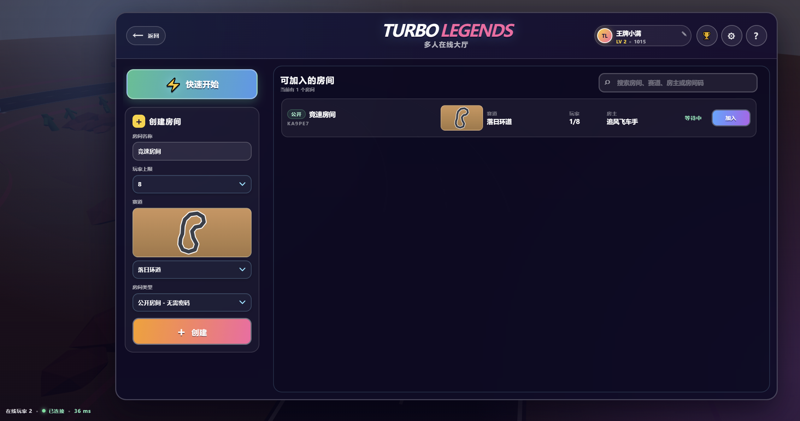
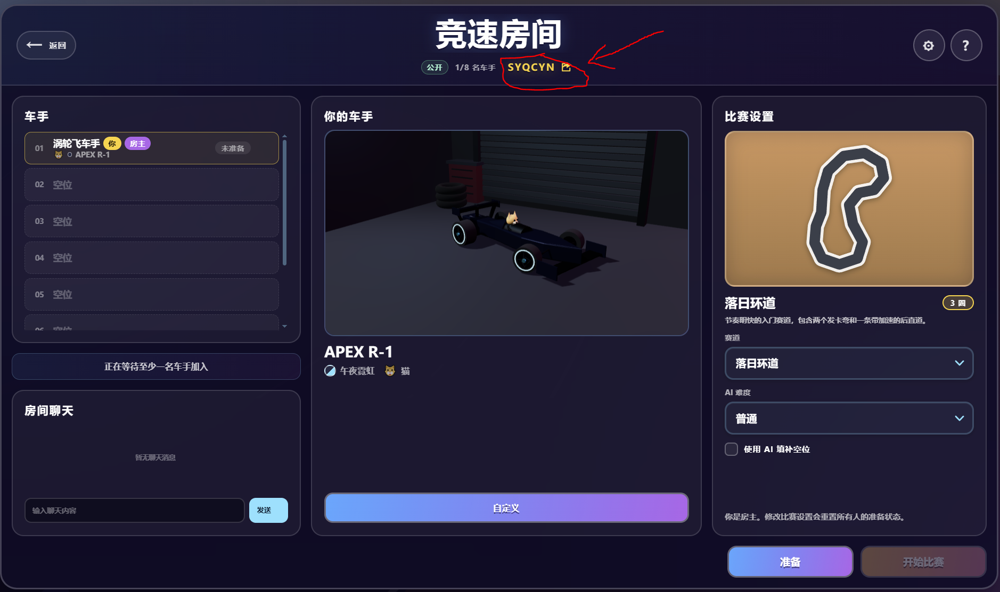
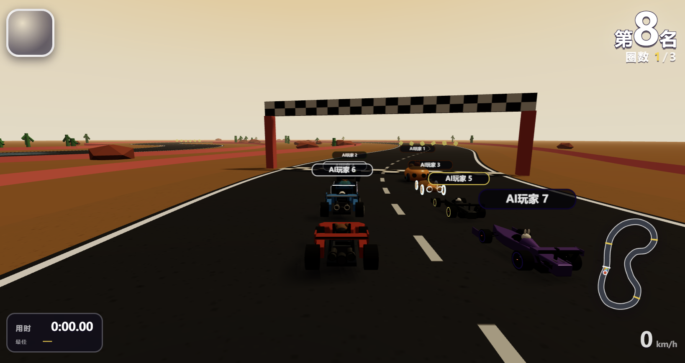

# 🏎️ Turbo Legends

A Mario Kart-style 3D kart racer with single-player and server-authoritative
online rooms. The browser has no build step: Three.js is vendored, visuals and
SFX are procedural, and the Node process serves both the game and WebSocket
multiplayer. The interface is available in Simplified Chinese and English.

  

## Screenshots

| Main menu | Multiplayer lobby |
|:---:|:---:|
|  |  |
| **Multiplayer room** | **Race start** |
|  |  |

*Screenshots show the Simplified Chinese interface; English can be selected in
the game settings.*

## Run locally

Requires Node.js 22.13 or newer because multiplayer profiles use `node:sqlite`.

```bash
npm install
npm start
```

Open `http://127.0.0.1:5173/`. ES modules require an HTTP origin, so opening
`index.html` directly from disk will not work. To test multiplayer, open the
page in two browser windows, create a room from the multiplayer lobby in one,
and join it from the room list in the other.

For other devices on the same LAN, listen on all interfaces and open the host
machine's LAN address (for example, `http://192.168.1.20:5173/`):

```powershell
$env:HOST = '0.0.0.0'
npm start
```

```bash
HOST=0.0.0.0 npm start
```

The process also exposes `GET /healthz` with uptime, room, race, and connection
counts. `GET /api/stats` is the public, short-cached aggregate used by title and
single-player screens, so those flows do not keep a WebSocket open.

## Run with Docker

The included Compose configuration publishes the game on host port `8888`:

```bash
docker compose up -d --build
curl http://127.0.0.1:8888/healthz
```

Compose mounts the named volume `turbo-legends-data` at `/data`, so the default
`/data/users.sqlite` guest database survives container replacement and restart.

Open `http://YOUR_VPS_IP:8888/` and allow inbound TCP port `8888` in both the
VPS firewall and the hosting provider's security group. See
[`DEPLOYMENT.md`](DEPLOYMENT.md) for the complete VPS deployment, update, and
troubleshooting guide.

## Multiplayer

- A live multiplayer lobby lists public and password-protected private rooms,
  with search, direct joining, invite codes, and quick match for available
  public rooms.
- Rooms choose a 2–8 human-player capacity; AI fills every race to eight karts.
  Full rooms and rooms already in a race remain visible but cannot be joined.
- Room names may repeat. Private rooms require a case-sensitive 3–20 character
  password, stored by the server only as a salted scrypt digest.
- The host chooses the track and AI difficulty. Every connected player must be
  ready before the host can start.
- Nicknames are display-only and may repeat. A Chinese combination nickname is
  chosen on first use regardless of the UI language and can be edited in the
  lobby; participant IDs remain the sole identity for permissions, reconnects,
  input, and results. Players may select
  the same one of six available Racers and independently choose one of 12 paints
  and 8 animal avatars. Two additional prototype Racers are shown as locked previews.
- The Room shows the local choice as a rotating 3D kart; the customization dialog
  previews Racer stats, paint, and avatar before saving the complete loadout.
- Single-player keeps its Racer-only selection flow: the chosen Racer receives
  its default appearance automatically, while AI paint and avatars are randomized.
- Changing any loadout field clears that player's ready state; changing track or
  difficulty clears everyone's ready state.
- Starting a race creates a seeded grid and a 10-second loading phase. If fewer
  than two connected players finish loading, the race is cancelled.
- The Node server owns physics, items, laps, ranks, and results. Browsers send
  inputs and locally smooth/predict presentation.
- A disconnected kart is immediately driven by takeover AI. The same live page
  can reclaim it with its in-memory session token for 30 seconds; takeover AI
  remains active until the resumed page sends a fresh movement input. The earliest
  joined connected player becomes host when needed.
- Online input uses client-side send-buffer backpressure, while remote racers use
  buffered snapshot interpolation so temporary Wi-Fi stalls do not replay stale
  controls or force ordinary movement corrections to teleport.
- Every player can return from results independently and prepare for the next
  race while remaining players are shown as `IN GAME`. The room becomes fully
  startable after everyone returns, or automatically after 30 seconds. Rooms
  with no connected players are hidden and expire after 60 seconds.
- Leaving a room or an online race returns to the multiplayer lobby. The online
  results screen only offers `RETURN TO ROOM`.
- Entering multiplayer creates or restores a guest profile through a long-lived
  HttpOnly cookie. The server persists nickname, XP/level, Rating, race/finish/
  escape rates, podium counts, and per-track fastest natural finish times.
- The multiplayer lobby exposes cached Rating, wins, level, and per-track speed
  leaderboards. One HTTP snapshot supplies all four tabs and is cached for 60
  seconds by default, so opening tabs never polls SQLite.
- Race progression ignores AI when calculating pairwise Rating. A natural finish
  locks the player's result, so leaving or disconnecting afterwards keeps normal
  rewards. Leaving before that point, or remaining disconnected for more than
  30 seconds, counts as an escape and excludes the player from XP, podium,
  record, and Rating updates.

Rooms and live reconnect credentials remain process-memory state, so restarting
the server clears active matches. Guest profiles and settled multiplayer results
are stored in SQLite and survive restarts. The current release does not include
password accounts, cross-device recovery, or cross-process room migration.

Invite links may include `?room=ROOMCODE`. Public rooms are joined automatically,
while private rooms ask for a password. Missing, full, and racing rooms report an
error and fall back to the lobby. Creating, joining, or resuming a room keeps its
code in the address bar; leaving clears it. Passwords are never placed in URLs or
browser storage. A legacy `localStorage` nickname is used only when the guest
profile is first created; the server is authoritative afterwards. `participantId`
and `resumeToken` remain in memory and legacy v1/v2 session records are purged.

## Controls

| Action | Keyboard | Gamepad |
|---|---|---|
| Steer | ← → / A D | Left stick |
| Accelerate | ↑ / W | A or RT |
| Brake / reverse | ↓ / S | B or LT |
| Hop / drift | Space / Shift | X or RB |
| Use item | Ctrl / E | Y or LB |
| Look back | R | — |
| Live standings | Hold Tab | — |
| Pause | Esc | Start |
| Mute | M | — |

Touch devices get on-screen controls automatically (auto-gas, steer zone on
the left, drift/item buttons on the right). Holding Tab shows live position,
lap, and racer status without pausing. In online races, pause is a local overlay:
the server race continues while the client sends neutral controls.

## The game

- **8 Racer cards**: 6 race-ready models with real stat trade-offs, plus 2 locked
  prototype previews with aspirational speed / accel / handling / weight figures
- **4 tracks** — Sunset Circuit, Harbor Loop, Summit Raceway, Aurora Icefall — with boost
  pads, item box rows, kerbs, elevation, and themed scenery
- **Drift & mini-turbo** — hop into a slide, hold it through the corner,
  release for blue → orange → purple tier boosts
- **10 items** — bananas, green/red/blue shells, mushrooms, bob-omb, star,
  lightning, Bullet autopilot — dealt by race position
- **AI drivers** with personalities, racing-line pursuit, mistakes,
  rubber-banding, item tactics, and disconnected-player takeover
- **3 difficulty levels**, rocket starts, jump-start penalties, drafting,
  lap timing, wrong-way detection, minimap, and results podium
- **Dynamic audio** — procedural WebAudio engines, skids and item SFX plus
  looping menu/track-specific MP3 soundtracks

## Server configuration

| Variable | Default | Purpose |
|---|---|---|
| `HOST` | `127.0.0.1` | HTTP/WebSocket listen address |
| `PORT` | `5173` | HTTP/WebSocket listen port |
| `ALLOWED_ORIGINS` | empty | Comma-separated extra WebSocket origins; same-origin is always accepted |
| `USER_DB_PATH` | `data/users.sqlite` | SQLite guest-profile database path |
| `USER_SESSION_CLEANUP_INTERVAL_MS` | `600000` | Expired guest-session cleanup interval; authentication still rejects expiry immediately |
| `GUEST_CREATION_LIMIT` | `0` | Maximum new guest accounts created per client IP in one window; `0` disables the limit and valid session resumes are not counted |
| `GUEST_CREATION_WINDOW_MS` | `600000` | New guest-account rate-limit window in milliseconds |
| `LEADERBOARD_CACHE_TTL_MS` | `60000` | Shared in-memory and browser leaderboard cache lifetime in milliseconds |
| `ADMIN_KEY` | empty | Enables the `/admin` dashboard and new analytics collection when set to at least 16 characters; empty keeps both disabled |
| `METRICS_TOKEN` | empty | Enables bearer-protected `GET /api/metrics`; empty keeps the route disabled |
| `METRICS_LOG_INTERVAL_MS` | `60000` | Structured aggregate metrics log interval |
| `TRUST_PROXY` | `false` | Trust proxy-sanitized forwarding headers for client IP and HTTPS cookies |
| `AUTH_SCRYPT_CONCURRENCY` | `2` | Maximum concurrent private-room scrypt jobs |
| `AUTH_SCRYPT_QUEUE_LIMIT` | `32` | Maximum waiting private-room scrypt jobs |
| `LOBBY_BROADCAST_DEBOUNCE_MS` | `100` | Lobby summary coalescing window |
| `MAINTENANCE_INTERVAL_MS` | `500` | Room expiry/loading/results maintenance interval |
| `STATIC_COMPRESSION_CACHE_BYTES` | `16777216` | Brotli/gzip in-memory LRU limit |

The multiplayer endpoint is `/ws` and automatically uses `wss://` when the
page is served over HTTPS. For public deployment, terminate TLS in the hosting
platform or reverse proxy and ensure WebSocket Upgrade requests for `/ws` are
forwarded to this process.

When `ADMIN_KEY` is enabled, open `/admin` on the same origin. The dashboard
stores only new aggregate traffic/race statistics from that point forward,
keeps full IP addresses out of SQLite, and uses the existing user database for
search, detail views, and deletion of inactive users.

Protocol v5 keeps lobby, room, authentication, events, and results as JSON, but
uses fixed little-endian binary packets for 20 Hz full race snapshots and the
client's 28-byte race input. `prepare_race` announces a nonzero `wireRaceId`
used only by those binary packets. Shared message names, validators, limits,
room states, and error codes live in `src/net/protocol.js`; the browser/Node
codec is `src/net/binary-race-codec.js`.

Older protocol traffic is intentionally incompatible. During an atomic v5
deployment, an old page receives `client_update_required`, the socket closes
with code `4006`, and the UI asks the player to refresh instead of reconnecting
forever.

Before opening `/ws`, the browser calls `POST /api/user/session`; WebSocket
upgrades without a valid guest cookie receive HTTP 401. `GET /api/me` reads the
current profile and `PATCH /api/me` updates the nickname. Room-entry messages do
not accept a client-authoritative nickname, and `user_progression` is private to
the affected player.

## Development

```bash
npm test         # Node test discovery: simulation, protocol, server, and UI contracts
npm run check    # import every browser module under Node (syntax/contract check)
npm run smoke:multiplayer # isolated Lobby/race/reconnect/private-auth load smoke
npm run ab:multiplayer-phase2 # temp-extracted v3 baseline vs sustained local v5 load
```

The authoritative simulation (`src/core`, `src/track`, `src/game`) is pure
JavaScript with no DOM or Three.js dependency. Local and online races expose a
common presentation-facing session shape, so rendering, HUD, audio, and input
do not need to know where the authoritative state lives. See
`ARCHITECTURE.md` for the module and protocol contracts.

All characters and tracks are original. The *genre* is a homage; the content
is ours.
